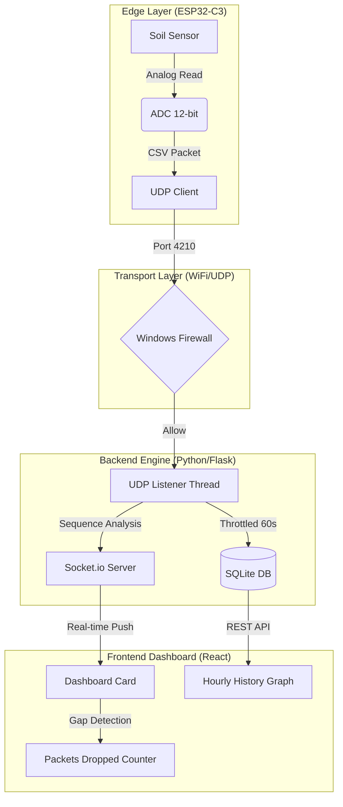

# FLEETMANAGER: Real-Time IoT Telemetry Dashboard

A high-performance observability platform for ESP32-C3 edge nodes. This system uses a custom UDP-based transport layer to stream telemetry data (such as soil humidity) to a MERN-style dashboard with sub-millisecond local latency.

---

## 🏗️ System Architecture

